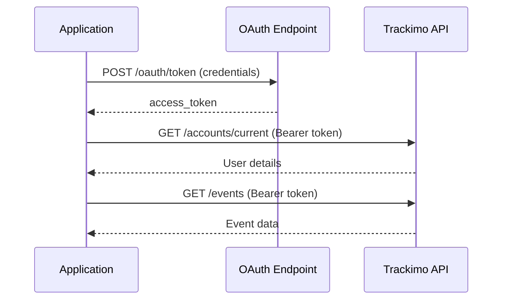

# Pet Tracker Rewards System - Requirements

## Main Objective

Create a React TypeScript application to manage the rewards program for Pet Tracker device users.

---

## Overview

### About Fidelidade

We are a company called **Fidelidade** that sells insurance, including pet insurance. We offer 4 types of Pet insurance plans:

- **Pet 1**
- **Pet 2**
- **Pet 3**
- **Pet Vital**

### Pet Tracker Product

We are now launching a new product called **Pet Tracker** for customers who want their pets to always carry a geo-location device. This device is manufactured by **Trackimo** and is provided with our Fidelidade branding.

### Device Functionality

The Pet Tracker, in addition to geo-location functionality, allows the creation of **geo-zones**. When the geographical boundaries of these zones are crossed, an entry or exit event is emitted. Geo-zones can serve as a security mechanism, as they can emit an alert if the pet owner desires.

### Rewards Program

Since entry and exit events are available through the Trackimo API, we decided to use this information to create a rewards plan based on completing a certain number of walks.

#### Walk Definition

A walk consists of:
1. **Exit from geo-zone** (e.g., "Home" geo-zone) → Signals the start of the walk
2. **Subsequent entry** into the same geo-zone → Signals the return home and end of the walk

**Valid Walk Criteria:**
- Duration must be **≥ 10 minutes (600 seconds)**

#### Reward Mechanism

- Users earn rewards by completing **monthly challenges**
- Rewards are given in **FidCoins** (our internal currency)
- Rewards are only awarded monthly
- One challenge can be completed each week of the month
- Prizes are awarded in bulk in the following month, in a monthly progress report

---

## Monthly Challenges

### 1. "Walk Three Times Each Day of the Week"

**Requirement:** Complete at least three walks per day from Monday to Sunday

**Accounting Rules:**
- Challenge is counted in the month when **Sunday** (the last day) occurs
- If the week spans from one month to another, the challenge belongs to the month where Sunday falls
- If the week spans from one year to another, the challenge is counted in the month and year where Sunday falls

**Rewards by Plan:**
- Pet 1: **50 FidCoins**
- Pet 2: **50 FidCoins**
- Pet 3: **70 FidCoins**
- Pet Vital: **70 FidCoins**

---

### 2. "Maintain Consistency"

**Requirement:** Complete sixty walks without a day passing where no walks are registered

**Rules:**
- No limit on daily walks
- Must have at least one walk every day for 60 consecutive walks
- If 60 consecutive walks occur without a day of interruption in the walk series, the challenge is considered complete

**Rewards by Plan:**
- Pet 1: **40 FidCoins**
- Pet 2: **40 FidCoins**
- Pet 3: **60 FidCoins**
- Pet Vital: **60 FidCoins**

---

### 3. "Walk All Month Long"

**Requirement:** Complete a total of 90 walks from the first to the last day of the month

**Rules:**
- Days can be skipped (no consistency required)
- Only the total number achieved is considered

**Rewards by Plan:**
- Pet 1: **50 FidCoins**
- Pet 2: **50 FidCoins**
- Pet 3: **70 FidCoins**
- Pet Vital: **70 FidCoins**

---

### 4. "Long and Frequent Walks"

**Requirement:** Complete a series of three consecutive walks with a duration ≥ 15 minutes (900 seconds)

**Rewards by Plan:**
- Pet 1: **50 FidCoins**
- Pet 2: **50 FidCoins**
- Pet 3: **70 FidCoins**
- Pet Vital: **70 FidCoins**

---

## Pet Tracker Device Technical Details

### How the Geo-Locator Device Works

1. The device communicates its location to the Trackimo API at regular intervals
2. The customer defines a geo-zone in the geographic area of their home
3. The Tracker is configured to emit a `GEOZONE_EXIT` event when leaving a geo-zone
4. The Tracker emits a `GEOZONE_ENTRY` event when returning

### Technical Implementation

When GPS coordinates are sent to the API:
- The API checks if they are within any geo-zone
- If a `GEOZONE_ENTRY` occurred previously, the API verifies if current coordinates are still inside that geo-zone
  - **If YES:** Nothing happens
  - **If NO:** A new `GEOZONE_EXIT` event is emitted, signaling movement outside the defined geo-zone

### Use Cases

These events are useful for:
- Configuring alarms
- Geo-zones can serve as security areas
- Exiting a geo-zone can signal unwanted movement of the pet

---

## API Event Structure

### GEOZONE_ENTRY Event

```json
{
  "id": 1017297,
  "message": "Loki Teste entrou em Casa",
  "lat": 38.764214,
  "priority": "NONE",
  "address": "",
  "speed": 0,
  "batteryLevel": 84,
  "extras": "",
  "archived": false,
  "alarmTypeAsInt": 15,
  "device_id": 608008629,
  "device_name": "Loki Teste",
  "read": true,
  "created": 1710973482000,
  "lng": -9.158205,
  "location_type": "GPS",
  "alarm_type": "GEOZONE_ENTRY",
  "geozone_name": "Casa",
  "account_email": "leonor.matos.alves@fidelidade.pt",
  "account_full_name": "Leonor Alves",
  "age": 11529830,
  "timestamp": "2024-08-01T09:08:32.841Z"
}
```

### GEOZONE_EXIT Event

```json
{
  "id": 1019857,
  "message": "Loki Teste saiu de Casa",
  "lat": 38.711109,
  "priority": "NONE",
  "address": "",
  "speed": 6,
  "batteryLevel": 65,
  "extras": "",
  "archived": false,
  "alarmTypeAsInt": 16,
  "device_id": 608008629,
  "device_name": "Loki Teste",
  "read": true,
  "created": 1711010188000,
  "lng": -9.145557,
  "location_type": "GPS",
  "alarm_type": "GEOZONE_EXIT",
  "geozone_name": "Casa",
  "account_email": "leonor.matos.alves@fidelidade.pt",
  "account_full_name": "Leonor Alves",
  "age": 11493124,
  "timestamp": "2024-08-01T09:08:32.841Z"
}
```

### Event Differences

Both events are identical in structure. The only differences are:
- `alarmTypeAsInt` field value
- `alarm_type` field value (most important for our use case)

---

## Rewards Calculation Technical Details

### Core Metrics

Our rewards program is centered on:
- **Quantity of walks**
- **Duration of walks**

### API Request Strategy

Due to Trackimo API implementation:
- Cannot process individual JSON objects
- Must send a request with a date range
- To calculate walks for a specific month and verify challenge completion:
  1. Wait until the following month
  2. Request walks from the first to the last day of the previous month

### Week Accounting Rules

**Important:** The day the week ends determines which month it belongs to.

**Scenarios:**
1. If the month doesn't end on Sunday → Last week of the month is not counted (will be included in the following month)
2. Many weeks will be divided between months (last week of the month)
3. If the first day of the month is not Monday → Must reconstruct the first week with necessary days from the previous month to complete 7 days

---

## Application Main Features

### 1. Dashboard

**Key Metrics:**
- Total users
- Total pets
- Total walks in the last month
- Total challenges completed in the last month
- Average walks per pet
- Average challenges completed per pet

**Rankings:**
- Top 10 monthly ranking of users with most challenges and walks completed

---

### 2. Users Table

**Columns:**
- ID
- User name
- NIF (Tax ID)
- Pet name
- Total walks
- Total challenges
- Account creation date

**Actions:**
- Remove user
- Edit user
- Add user button

**Filtering:**
- Text filter that tries to match any table field

---

### 3. Walks Table

**Columns:**
- ID
- Pet name
- Exit geo-zone
- Entry geo-zone
- Duration

**Actions:**
- Add walk
- Remove walk
- Edit walk

**Filtering:**
- Text filter that tries to match any table field

---

### 4. Monthly Rewards Export

**Functionality:**
- Extract monthly rewards list in **Excel format**
- Include all users who completed challenges
- Show which challenges were completed by each user

---

## Trackimo API Configuration

### Credentials

```typescript
const config = {
  username: 'fidelidade@trackimo.com',
  password: 'Fidelidade@1234',
  serverUrl: 'https://app.trackimo.com',
  clientId: '9092cd94-a728-47b7-86da-e15c9a3d4cdb',
  clientSecret: '9f540cd42ec8d3bc452ce39cdd3d6de4',
  redirectUri: 'https://app.trackimo.com/api/internal/v1/oauth_redirect'
} as const;
```

**Base API URL:** `https://app.trackimo.com`

---

## API Endpoints Reference

### 1. Authentication

**POST** `/api/v3/oauth/token`

**Purpose:** Authenticate and obtain OAuth access token

**Request:**
```typescript
{
  username: string;
  password: string;
}
```

**Response:**
```typescript
{
  access_token: string;  // Valid for ~1 hour
}
```

---

### 2. Get User Details

**GET** `/api/v3/accounts/current`

**Purpose:** Retrieve current user account information

**Headers:**
```
Authorization: Bearer {access_token}
```

**Response:**
```json
{
  "account_id": "12345",
  "email": "user@example.com",
  "full_name": "John Doe",
  "role": "admin"
}
```

---

### 3. Get Account Descendants

**GET** `/api/v3/accounts/{account_id}/descendants`

**Purpose:** Get sub-accounts and related account hierarchy

**Headers:**
```
Authorization: Bearer {access_token}
```

**Response:** List of descendant account objects

**Use Case:** Retrieving all users/pets under a main account

---

### 4. Get Events

**GET** `/api/v3/accounts/{account_id}/events`

**Purpose:** Fetch geolocation events for devices

**Query Parameters:**
- `types`: Event types (GEOZONE_ENTRY, GEOZONE_EXIT)
- `from`: Start timestamp (Unix timestamp)
- `to`: End timestamp (Unix timestamp)
- `sort`: Chronological sorting
- `device_id` (optional): Filter by specific device

**Headers:**
```
Authorization: Bearer {access_token}
```

**Response:**
```json
[
  {
    "id": "event_123",
    "device_id": "608007866",
    "alarm_type": "GEOZONE_EXIT",
    "lat": 38.7223,
    "lng": -9.1393,
    "created": 1697452800
  }
]
```

---

### 5. Get Devices

**GET** `/api/v3/accounts/{account_id}/devices`

**Purpose:** Get all devices associated with account

**Headers:**
```
Authorization: Bearer {access_token}
```

**Response:**
```json
[
  {
    "id": "608007866",
    "name": "Pet Tracker 1",
    "type": "GPS",
    "status": "active"
  }
]
```

---

## Walk Processing Logic

### Valid Walk Identification

A valid walk is identified as:
1. **EXIT Event** (walk start)
2. Followed by **ENTRY Event** (walk end)
3. **Minimum Duration:** 10 minutes
4. **Same Device:** Both events from same device
5. **Same Geo-zone:** EXIT and ENTRY from same zone

### Walk Calculation

```typescript
const walkDuration = entryTime - exitTime;
const walkDistance = haversineDistance(exitCoords, entryCoords);
const walkSpeed = walkDistance / walkDuration;
```

---

## Event Types Tracked

### GEOZONE_ENTRY
- **Description:** Triggered when pet enters a defined geofence zone (typically home)
- **Use Case:** Marks the end of a walk

### GEOZONE_EXIT
- **Description:** Triggered when pet exits a defined geofence zone
- **Use Case:** Marks the start of a walk

---

## Authentication Flow



### OAuth 2.0 Flow Steps

1. **Login:** POST credentials to `/api/internal/v2/user/login`
2. **Get Auth Code:** GET OAuth authorization code
3. **Exchange Token:** POST code to `/api/v3/oauth2/token`
4. **Receive Token:** Get access token valid for ~1 hour
5. **API Calls:** Use token in `Authorization: Bearer {token}` header

---

## Implementation Notes

### Token Management
- Access tokens are valid for approximately **1 hour**
- Should implement token caching to reduce authentication calls
- Token should be refreshed before expiration

### Date Range Processing
- API requires date ranges (cannot process individual events)
- For monthly calculations, wait until the following month
- Request all events from first to last day of previous month

### Week Boundary Handling
- Weeks that span multiple months require special handling
- First week of month may need days from previous month
- Last week of month may be counted in following month

---

## Technical Stack

- **Frontend:** React + TypeScript
- **Backend API:** Azure Functions
- **Database:** Azure Cosmos DB
- **External API:** Trackimo API
- **Styling:** Tailwind CSS
- **State Management:** React Hooks
- **Data Export:** Excel (xlsx library)

---

## Security Considerations

⚠️ **Important Security Notes:**

1. **Credentials Management**
   - Never hardcode credentials in source code
   - Use environment variables
   - Consider Azure Key Vault for production

2. **API Token Handling**
   - Implement secure token storage
   - Use HTTPS only
   - Implement token refresh logic

3. **Data Privacy**
   - User data (NIF, email) must be handled securely
   - Implement proper authentication/authorization
   - Follow GDPR compliance requirements

---

## Performance Optimization Recommendations

### API Call Frequency
- Implement token caching (reduces auth calls by 95%)
- Use batch processing for events
- Implement retry logic for failed requests
- Add rate limiting to prevent API throttling

### Expected API Calls (Daily)
- Authentication: 2 calls
- User details: 2 calls
- Descendants: 1 call
- Devices: ~50 calls (depends on account count)
- Events: 1 call

**Total:** ~56 API calls per day

---

## Future Enhancements

### Potential Features
- Real-time walk tracking
- Push notifications for completed challenges
- Social features (compare with other users)
- Advanced analytics dashboard
- Mobile app integration
- Automated reward distribution

### Technical Improvements
- Implement pagination for large datasets
- Add comprehensive error handling
- Create automated tests
- Add performance monitoring
- Implement advanced caching strategies

---

## Document Information

- **Created:** October 21, 2025
- **Last Updated:** October 21, 2025
- **Version:** 1.0
- **Status:** Active Requirements
- **Related Documents:**
  - `COSMOS_DB_SETUP.md`
  - `DEPLOYMENT.md`
  - `BACKEND_GUIDE.md`
  - `README.md`
